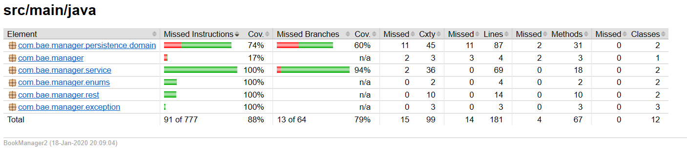

# BookManager

In fulfilment of the solo project assignment due Monday 20/01/2020 at QA Consulting.

## Index
[Overview](#overview)
   * [My Product](#product)

[Architecture](#architecture)
   * [Entity Relationship Diagrams](#erd)
     * [Initial ERD](#initialERD)
     * [Final ERD](#finalERD)
   * [Overall Architecture](#overall)

[Technologies](#tech)
   * [CI/CD Pipeline](#cicd)

[Testing And Code Review](#test)
   * [Reports](#reports)

[Front-End Design](#design)
   * [Wireframes](#wireframes)
   * [Actual Appearance](#finalLook)

[Deployment](#deployment)

[Project review](#review)
   * [Journey](#journey)
   * [Self-Reflection](#insight)
   * [Future Improvements](#future)

[Authors](#authors)

[Acknowledgements](#acks)

## Overview

To design an application with a topic of my choice that - as a minimum - utilises CRUD (Create, Read, Update, Delete) functionality. This application should incorporate the core technologies and teachings covered in the training up to that point and access at least 2 database tables.

### My Product

For the product I took inspiration from my desire to effectively keep track of the books I am reading at any given time.

I want to be able to manage my entire collection and have a record of any I want to get in the future. I also want to be able to update these records if anything changes or delete them if they are no longer relevant.

## Architecture

### Entity Relationship Diagrams

#### Initial ERD

As can be seen in my initial ERD, I intended to have an author and a book table in a many-to-many relationship, implemented with the use of a linking table inbetween. With the posibility of including separate user accounts, each with their own books if time allowed.

#### Final ERD

My final ERD shows that whilst I did meet my necessary requirement there was not the time to implement the extra table. The decision was also made to remove the ISBN field after realising the sheer number of different ISBN's a single book can have.

### Overall Architecture

The above diagram details a high level overview of the project architecture;it includes all non-IDE generated methods and a mapping of all the classes present in the application structure (excluding the custom exceptions and enums and the test classes and their associated resources). 

## Technologies

* H2 In-Memory Database
* Java - Business Logic
* Spring Boot - Opinionated Application Framework
* HTML5, CSS and Javascript - Front-End
* [GitHub](https://github.com/lukecottenham/BookManager) - VCS
* [Trello Board](https://trello.com/b/GmzuBWTd/book-manager) - Project Tracking
* Jenkins - CI Server
* Maven - Build Tool and Dependency Management
* JUnit and Mockito - Unit Testing
* Selenium - Front-End Testing
* SonarQube - Static Code Analysis
* EclEmma and Surefire - Test Reporting
* AWS - Live Environment
* Tomcat - Deployment

### Continuous Integration/Continuous Development Pipeline

This pipeline shows all of the technologies used in the making, designing and deploying of my project.

## Testing And Code Review

### Reports

The [Surefire Report](./documentation/surefire-report.pdf) asserts that all 76 of the separate tests successfully pass on build of the application.

As can be seen above, the Sonarqube static code analysis, detected 0 bugs and 0 code smells. The 3 vulnerabilities are from the use of the entity dao's within the controller classes and once a better understanding of the procedure for handling the transfer of database objects has been gained this will be corrected in a future sprint. I could not get the Jacoco plugin to show test coverage in Sonarqube working, so used the ECLEmma plugin for Eclipse instead.

The test coverage for the back-end is 88%, as shown above, and there are 4 separate Selenium tests that cover the workings of the CRUD functionality and the page navigation.

## Front-End Design

### Wireframes

The below diagrams outline my initial ideas for how the basic layout of the application front-end should look.

The Home page was intended to be a searchable list of books with some simple filters for the user.

The Add Books page was intended to be a form for the user to fill in the details of their chosen book before submitting it to add to the database. There would be validation in place to enforce the relevant business logic for each field.

The Update/Delete Books page was intended to be a similar list to that of the Home page, just not searchable, with options to update the book completion, owned/wishlist and read count fields or delete the whole book. 

### Actual Appearance

The Home page ended up being nearly identicle to the wireframe in terms of functionality, save for the absoption of the filter buttons into a combination of the search and table ordering.

The Add Books page also ended up being very similar to the wireframe, with the only notable differences being the removal of the ISBN field and the change in method of input for a couple of the fields.

The wireframe that was strayed furthest from was that for the Update/Delete Books page. It ended up being a similar table to that on the Home page, just with clickable rows for the user to then choose whether to update of delete the related book. 

The update feature got extended to every field available to the user and was implemented on a form akin to that for adding a book, but with the book's details pre-populated for the user's convenience.

## Deployment

The project is configured to be deployable locally or externally on a virtual machine with the context path "/BookManager". In order for the Selenium tests to pass for building or packaging, a Linux Chromedriver is present in the project root folder. 

For use on another OS, simply replace this with the relevant Chromedriver and change the extension in the "src/test/java/com/bae/manager/selenium/constants/Constants.java" PATH constant to match your driver.

As might be suggested by the mentions of Chromedriver, this project has been designed and tested with Chrome in mind, so some of the functionality or formatting may not be compatible with other browsers, especially some of the older versions of Internet Explorer.

## Project review

### Journey

Overall I believe this project has been a success, with the CRUD functionality required being provided on a quality code-base. My progression through the learning has been enjoyable, seeing how each new technology integrates with what I have made using the previous one.

### Self-Reflection

Despite the fact I am pleased with the resulting product, if I were to start again from scratch there are things that I would like to do differently:
* I would have a better understanding of how the workload would progress and therefore be able to produce a more useful division of the work behind user stories for the project management board.
* In turn, this would allow me to more effectively use the board assign timescales and to keep track of my progression through the tasks.
* I would also use the VCS more effectively, by splitting branches more strictly into specific features. This would make for a more maintainable structure for testing and review of any changes to be merged and the faster deployment of new features and feature updates.

### Future Improvements

In future sprints I would like to add features including, but not limited to:
* An emailing service where users can send a list of all the books on their wishlist to an email address, as a present suggestion or similar.
* Individual accounts, so multiple different users can keep track of their own book collection.
* Friend associations for the users so that they can see each other's collections, for the purpose of saving money by borrowing books instead of buying new for example.

## Authors

This application was written by Luke Cottenham.

## Acknowledgements

* All the QA trainers that kindly helped me solve the bugs that would've kept me up at night.
* The rest of my cohort that helped me spot the tiny mistakes that somehow broke the whole application.

